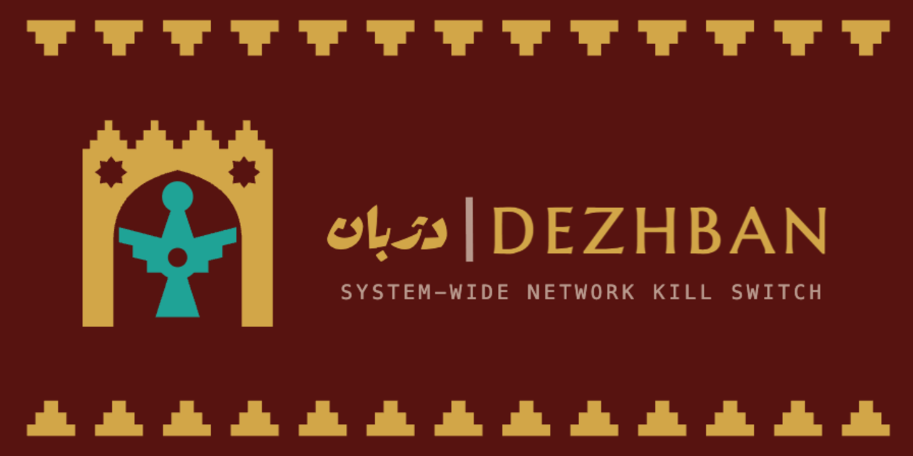

# Dezhban

> Persian *dežbān* (دژبان) — "gatekeeper / garrison guard."



**dezhban makes sure your traffic can only leave this machine through your VPN.**
If the VPN drops, your connection is cut instantly instead of silently falling
back to your real IP. If the VPN reconnects somewhere you've told it to refuse,
everything stops. On macOS it's a menubar app you click; everywhere else, and
for anyone who prefers it, it's a CLI and background service.

```
  [ your machine ] --- VPN tunnel up ---> [ the internet ]

      VPN drops: nothing to react to, the standing rule
      already blocks every non-tunnel path
              |
              v
  [ egress cut, instantly ]   (a plain kill switch would leak right here)
```

> [!WARNING]
> dezhban deliberately cuts network access. A wrong VPN endpoint, a crash before
> teardown, or running it over a remote session can **lock you out of your own
> machine**. The escape hatch is the menubar app's **Panic** button, or
> `sudo dezhban panic` from a terminal — either works with no daemon running.
> Read [docs/usage/getting-started.md](docs/usage/getting-started.md) before arming
> it for real.

## Platform support

| | macOS | Linux | Windows |
|---|---|---|---|
| App | Menubar + window | — | — |
| CLI | ✅ | ✅ | ✅ (experimental) |
| Enforcement backend | `pfctl` | `nft` | WFP |

Windows is an early target: `go vet` gates it in CI, but the control socket's
whole authorization model is unix permissions, which Windows has no equivalent
of yet, so there's no passwordless path there today. Use the CLI, and expect
rough edges.

## Install (macOS)

```sh
curl -fsSL https://raw.githubusercontent.com/Behnam-RK/dezhban/main/scripts/install.sh | sudo bash
```

Then open **Dezhban** from Applications (or Spotlight). That's the only
terminal step, ever — not because the app can't be double-clicked, but because
there's no Apple Developer certificate to sign it with yet, so Gatekeeper would
otherwise block it. `curl` genuinely doesn't trip that check (it's documented
Apple behavior, not a workaround), so this line installs the app with **zero
Gatekeeper friction** and asks for your password exactly once. Details, the
`.pkg` alternative, and Linux/Windows installers:
[docs/usage/install.md](docs/usage/install.md).

## Using the app

Open the app and everything else happens by clicking:

- **Menubar dropdown** — the safety core. One glance tells you the posture
  (e.g. "Guard — NL via Mullvad"); **Block now** / **Unblock**, the VPN switch
  window with a live countdown, and **Panic**. These never require the main
  window to be open.
- **Overview** — live status, the daily controls, and guided recovery: if the
  service isn't installed or is stopped, there's an inline button for exactly
  that, not an error message.
- **Settings** — a full config editor: VPN tunnel/endpoints, autodetection,
  blocked countries, both windows' durations, local-network access, start at
  boot, launch at login. One confirmation per batch of changes, not one per
  field.
- **Logs & Diagnostics** — read-only `doctor`, recent logs, a live log stream.
- Privileged actions (install, start/stop, panic) prompt with **Touch ID** where
  available; routine block/unblock/switch need no prompt at all.

A GUI user never needs a terminal again — including for upgrades, which the app
checks for and applies in place.

## Headless / CLI

Linux, servers, and anyone who prefers a terminal on any OS:

```sh
sudo dezhban setup                # interactive wizard — build the config, no JSON by hand
dezhban validate                  # confirm it (--config is optional)
dezhban monitor                   # live IP/country/tunnel/verdict, no firewall touched

sudo dezhban run                  # run the daemon (root; drives the firewall)
sudo dezhban panic                # always-available teardown, no daemon needed
```

Full walkthrough: [docs/usage/getting-started.md](docs/usage/getting-started.md).
Complete command reference: [docs/usage/cli.md](docs/usage/cli.md). Tab-completion:
`source <(dezhban completion zsh)`.

## Postures at a glance

One enforcement model — the guard. What changes is the posture:

```
  STANDBY  --arm-->  GUARD  <==>  FULL BLOCK   (blocked / allowed country)
                        |
                        +--switch or reconnect-->  SWITCH WINDOW
                                                    (bounded, self-closing)
```

- **STANDBY** — no rules, network fully open, **not protecting.** The resting
  state before any tunnel has been observed. Arms itself when a VPN connects.
- **GUARD** — the healthy state. Only the tunnel may carry traffic off the
  machine, so a drop is cut instantly (zero leak window with
  `vpn.reconnectWindow: "0"`; by default a bounded reconnect window follows the
  cut so the VPN can redial).
- **FULL BLOCK** — the VPN's exit landed in a blocked country. All user traffic
  is cut, but the endpoint handshake stays open so the tunnel can recover.
- **SWITCH WINDOW** — the one sanctioned relaxation, bounded and self-closing,
  from exactly two triggers: an explicit operator command, or the automatic
  reconnect window.

Full state machine and exact rulesets: [docs/concepts/modes.md](docs/concepts/modes.md).

## Configuration

JSON, with durations as strings (e.g. `"30s"`). Sample configs live in `configs/`
(`dezhban.example.json` is fully automatic; `dezhban.vpn-guard.json` pins the
tunnel interface and endpoints explicitly). Full field reference:
[docs/usage/config.md](docs/usage/config.md).

## Documentation

See [docs/README.md](docs/README.md) for the full set, grouped by audience —
using it, the mental model, and contributing.

## License

[MIT](LICENSE) © 2026 Behnam RK
